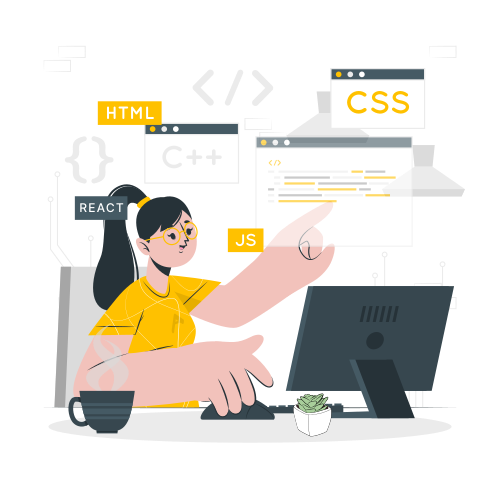

  

<h1 align="center">
    
</h1>

<h3 align="center">A passionate frontend developer from India</h3>

🔭 I’m currently working on **E-commerce web app**

🌱 I’m currently learning **React, React Native**

📄 Know about my experiences [Resume](https://drive.google.com/file/d/1w0gXK4WmIuA1_XSwFWlXsCVIuoYJlbhh/view?usp=sharing)

⚡ Fun fact **I am an artist**

 
  
  
  <!--add portfolio -->
  

 

 
<h2 align="center">⚒️ Languages-Frameworks-Tools ⚒️</h2>
 
<!-- add languages -->

    
     

 

<h2 align="center">⚡ Stats ⚡</h2>
 

  
